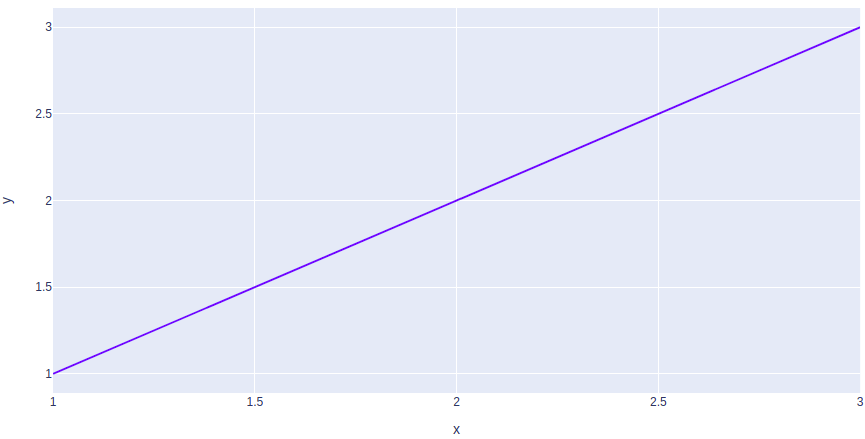
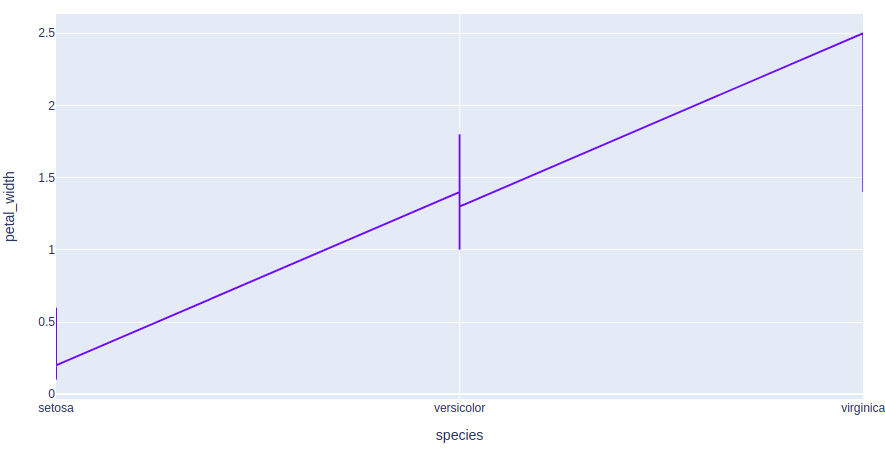
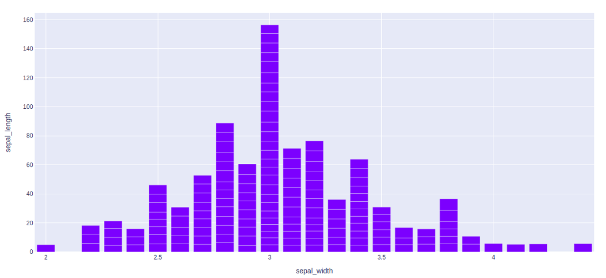
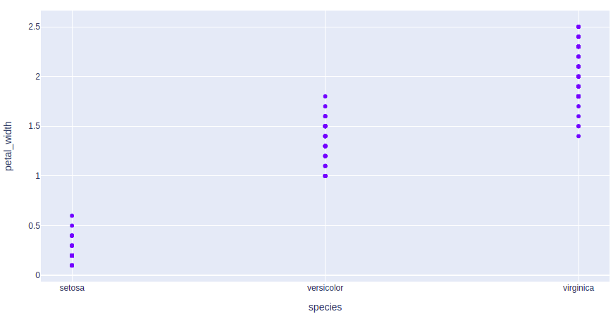
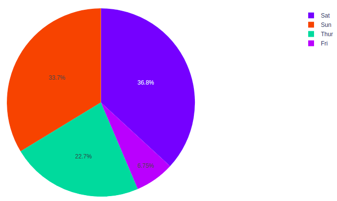

# Plotly Open Source Graphing Library for Python
# Content

- [Introduction to plotly](#introduction-to-plotly)
- [Installation](#installation)
- [Package Structure of Plotly](#package-structure-of-plotly)
- [Simple plot](#simple-plot) 
- [Creating Different Types of Charts related to data visualization :](#creating-different-types-of-charts-related-to-data-visualization)  
     1 [Line Chart](#line-chart)  
     2 [Bar Chart](#bar-chart)  
     3 [Histograms](#histograms)  
     4 [Scatter Plot and Bubble charts](#scatter-plot-and-bubble-charts)  
     5 [Pie Charts](#pie-charts)  
     6 [Box Plots](#Box.Plots)  
     7 [Violin plots](#Violin.plots)  
     8 [Gantt Charts](#Gantt.Charts)  
     9 [Contour Plots](#Contour.Plots)  
     10 [Heatmaps](#Heatmaps)  
     11 [Error Bars](#Error.Bars)  
     12 [3D Line Plots](#3D.Line.Plots)  
     13 [3D Scatter Plot Plotly](#3D.Scatter.Plot.Plotly)  
     14 [3D Surface Plots](#3D.Surface.Plots)  
- [Interacting with the Plots:](#Interacting.with.the.Plots)  
     1 [Creating Dropdown Menu in Plotly](#Creating.Dropdown.Menu.in.Plotly)  
     2 [Adding Buttons to the Plot](#Adding.Buttons.to.the.Plot)  
     3 [Creating Sliders and Selectors to the Plot](#CreatingSlidersandSelectorstothePlot)  
- [More Plots using Plotly](#More.Plots.using.Plotly)  
- [Conclusion]

## _Introduction to plotly_

**Python Plotly** Library is an open-source library that can be used for **data visualization and understanding data simply and easily**. Plotly supports various types of plots like line charts, scatter plots, histograms, cox plots, etc  
- Plotly has hover tool capabilities that allow us to detect any **outliers** or anomalies in a large number of data points.  
- It is visually attractive that can be accepted by a wide range of audiences.  
- It allows us for the endless customization of our graphs that makes our plot more meaningful and understandable for others.  
## _Installation_
Plotly does not come built-in with Python. To install it type the below command in the terminal.  
```sh
pip install plotly
```
## _Package Structure of Plotly_  

There are three main modules in Plotly. They are:
- plotly.plotly
- plotly.graph.objects
- plotly.tools
- plotly.express  

**plotly.plotly** sert d'interface entre la machine locale et Plotly. Il contient des fonctions qui nécessitent une réponse du serveur de Plotly.  
**plotly.graph_objects** module contains the objects (Figure, layout, data, and the definition of the plots like scatter plot, line chart) that are responsible for creating the plots.  The Figure can be represented either as dict or instances of **plotly.graph_objects.Figure** and these are serialized as JSON before it gets passed to plotly.js. Consider the below example for better understanding.  
**plotly.tools** provides various additional tools. For example, it allows you to create subplots, i.e. a set of sub-graphs.  
**plotly.express** allows us to display our graphs immediately. 

## _Simple plot_ 
After learning the installation and basic structure of the Plotly, let’s create a simple plot using the pre-defined data sets defined by the plotly.  
Example:
```sh
import plotly.express as px


# Creating the Figure instance
fig = px.line(x=[1, 2, 3], y=[1, 2, 3])

# showing the plot
fig.show()
```
Output:
  

In the above example, the plotly.express module is imported which returns the Figure instance. We have created a simple line chart by passing the x, y coordinates of the points to be plotted.

## _Creating Different Types of Charts related to data visualization_  
With plotly we can create more than 40 charts and every plot can be created using the **plotly.express and plotly.graph_objects class**. Let’s see some commonly used charts with the help of Plotly.  

### _Line Chart_
[Line plot](https://www.geeksforgeeks.org/line-chart-using-plotly-in-python/) in Plotly is much accessible and illustrious annexation to plotly which manage a variety of types of data and assemble easy-to-style statistic. With **px.line** each data position is represented as a vertex  (which location is given by the x and y columns) of a polyline mark in 2D space.  
Example:  
```sh
import plotly.express as px

# using the iris dataset
df = px.data.iris()

# plotting the line chart
fig = px.line(df, x="species", y="petal_width")

# showing the plot
fig.show()
```  
Output :
  
Refer to the below articles to get detailed information about the line charts.
- [plotly.express.line() function in Python](https://www.geeksforgeeks.org/plotly-express-line-function-in-python/)
- [Line Chart using Plotly in Python](https://www.geeksforgeeks.org/line-chart-using-plotly-in-python/)

### _Bar Chart_  
A [bar chart](https://www.geeksforgeeks.org/bar-chart-using-plotly-in-python/) is a pictorial representation of data that presents categorical data with rectangular bars with heights or lengths proportional to the values that they represent. In other words, it is the pictorial representation of dataset. These data sets contain the numerical values of variables that represent the length or height.  
Example:  
```sh
import plotly.express as px

# using the iris dataset
df = px.data.iris()

# plotting the bar chart
fig = px.bar(df, x="sepal_width", y="sepal_length")

# showing the plot
fig.show()
```  
Output :  
  
Refer to the below articles to get detailed information about the bar chart.
- [Bar chart using Plotly in Python](https://www.geeksforgeeks.org/bar-chart-using-plotly-in-python/)
- [How to create Stacked bar chart in Python-Plotly?](https://www.geeksforgeeks.org/how-to-create-stacked-bar-chart-in-python-plotly/)
- [How to group Bar Charts in Python-Plotly?](https://www.geeksforgeeks.org/how-to-group-bar-charts-in-python-plotly/)

### _Histograms_  
A [histogram](https://www.geeksforgeeks.org/histogram-using-plotly-in-python/) contains a rectangular area to display the statistical information which is proportional to the frequency of a variable and its width in successive numerical intervals. A graphical representation that manages a group of data points into different specified ranges. It has a special feature that shows no gaps between the bars and similar to a vertical bar graph.  
Example: 
```sh
import plotly.express as px

# using the iris dataset
df = px.data.iris()

# plotting the histogram
fig = px.histogram(df, x="sepal_length", y="petal_width")

# showing the plot
fig.show()
```  
Output :  
  
Refer to the below articles to get detailed information about the histograms.

- [Histogram using Plotly in Python](https://www.geeksforgeeks.org/histogram-using-plotly-in-python/)  
- [Histograms in Plotly using graph_objects class](https://www.geeksforgeeks.org/histograms-in-plotly-using-graph_objects-class/)  
- [How to create a Cumulative Histogram in Plotly?](https://www.geeksforgeeks.org/how-to-create-a-cumulative-histogram-in-plotly/)

### _Scatter Plot and Bubble charts_  
A [scatter plot](https://www.geeksforgeeks.org/scatter-plot-using-plotly-in-python/) is a set of dotted points to represent individual pieces of data in the horizontal and vertical axis. A graph in which the values of two variables are plotted along X-axis and Y-axis, the pattern of the resulting points reveals a correlation between them.  
A [bubble plot](https://www.geeksforgeeks.org/bubble-chart-using-plotly-in-python/) is a scatter plot with bubbles (color-filled circles). Bubbles have various sizes dependent on another variable in the data. It can be created using the scatter() method of plotly.express.
Example 1: Scatter Plot  
```sh
import plotly.express as px

# using the iris dataset
df = px.data.iris()

# plotting the scatter chart
fig = px.scatter(df, x="species", y="petal_width")

# showing the plot
fig.show()
```  
Output : 

Example 2: Bubble Plot  
```sh
import plotly.express as px

# using the iris dataset
df = px.data.iris()

# plotting the bubble chart
fig = px.scatter(df, x="species", y="petal_width",
				size="petal_length", color="species")

# showing the plot
fig.show()
```  
Output :  
  
Refer to the below articles to get detailed information about the scatter plots and bubble plots.
- [plotly.express.scatter() function in Python](https://www.geeksforgeeks.org/plotly-express-scatter-function-in-python/)
- [Scatter plot in Plotly using graph_objects class](https://www.geeksforgeeks.org/scatter-plot-in-plotly-using-graph_objects-class/)
- [Scatter plot using Plotly in Python](https://www.geeksforgeeks.org/scatter-plot-using-plotly-in-python/)
- [Bubble chart using Plotly in Python](https://www.geeksforgeeks.org/bubble-chart-using-plotly-in-python/)  
### _Pie Charts_
A [pie chart](https://www.geeksforgeeks.org/pie-plot-using-plotly-in-python/) is a circular statistical graphic, which is divided into slices to illustrate numerical proportions. It depicts a special chart that uses “pie slices”, where each sector shows the relative sizes of data. A circular chart cuts in a form of radii into segments describing relative frequencies or magnitude also known as circle graph.  
Example:  
```sh
import plotly.express as px

# using the tips dataset
df = px.data.tips()

# plotting the pie chart
fig = px.pie(df, values="total_bill", names="day")

# showing the plot
fig.show()
```  
Output :  
  
Refer to the below articles to get detailed information about the pie charts.
- [Pie plot using Plotly in Python](https://www.geeksforgeeks.org/pie-plot-using-plotly-in-python/)


